# Minelander

**A vehicle-mounted low-visibility and collision-risk monitoring module for mine haul roads.**
Minelander estimates fog risk, measures the distance to obstacles ahead, computes Time-to-Collision (TTC), senses road slope, and turns all of that into a three-level safety state (SAFE / CAUTION / DANGER) with driver alerts. A separate ROS 2 / Gazebo simulation is used to test the same ideas with a LiDAR.

> **⚠️ MINELANDER IS A MONITORING AND ALERTING SYSTEM — NOT AN AUTONOMOUS VEHICLE.**
> **The driver is alerted. Any decision to reroute, stop, or reverse is solely the driver's decision.**
> The RC-scale prototype in this repository also contains actuator code (throttle scaling, stop, and a scripted detour) purely so the safety response can be *demonstrated* on a bench vehicle. See [Safety and Decision Logic](#safety-and-decision-logic).

## Two separate systems in one repository

This repository contains two things that are easy to confuse. They are different systems:

| | **Physical Minelander (hardware)** | **ROS2 Simulation (testing only)** |
|---|---|---|
| What it is | The actual safety module: microcontroller firmware plus sensors on a vehicle | A laptop-side simulation and LiDAR visualisation used to test TTC and LiDAR ideas |
| Runs on | Arduino Nano + ESP8266 (NodeMCU-style) | Ubuntu 22.04, ROS 2 Humble, Gazebo Classic, RViz2 |
| Sensors | Ultrasonic, IR, MPU6050 IMU (fog inputs are currently test values) | Simulated 2D LiDAR in Gazebo; a real RPLIDAR A1M8 for RViz visualisation |
| Code | [`arduino_bot/`](arduino_bot), [`gimbal/`](gimbal), [`gps/`](gps) | [`src/lidar_ttc_bot/`](src/lidar_ttc_bot), [`Lidar/`](Lidar) |
| Needs ROS 2? | **No** | Yes |

> **ROS 2 is used as a simulation/testing environment. It is NOT the underlying software platform of the physical Minelander hardware system.** The physical system is plain microcontroller firmware (Arduino C++) with no ROS 2 dependency.

## Contents

- [Overview](#overview)
- [Key Features](#key-features)
- [Hardware Architecture](#hardware-architecture)
- [Hardware Components](#hardware-components)
- [Repository Structure](#repository-structure)
- [Software and Code Structure](#software-and-code-structure)
- [Time to Collision (TTC)](#time-to-collision-ttc)
- [Fog and Visibility Calculation](#fog-and-visibility-calculation)
- [Safety and Decision Logic](#safety-and-decision-logic)
- [System Workflow](#system-workflow)
- [ROS2 Simulation](#ros2-simulation)
- [Prototype and Results](#prototype-and-results)
- [Installation and Setup](#installation-and-setup)
- [Limitations](#limitations)
- [Future Work](#future-work)
- [Credits](#credits)
- [License](#license)

---

## Overview

### What Minelander is

Minelander is a compact sensing-and-decision module intended to be mounted on a mining vehicle. It watches the road ahead and the vehicle's own tilt, reasons about how dangerous the situation is, and alerts the driver. The prototype in this repository is built on a small RC-scale vehicle platform.

### The problem it addresses

Mine haul roads combine several hazards: fog and other low-visibility conditions, slopes, and obstacles (fallen rock, stopped vehicles) or slower vehicles ahead. In poor visibility a driver may notice a hazard late. Minelander aims to give an earlier, objective warning based on measured distance and closing speed, while also accounting for weather-driven fog risk and road gradient.

### The operating scenario

A vehicle drives along a haul road. Ahead there may be a static obstacle or another vehicle. Minelander:

1. estimates how likely fog is from temperature and humidity,
2. measures the distance to whatever is in front,
3. derives how fast the gap is closing and therefore the Time-to-Collision,
4. reads the vehicle's pitch to recognise uphill/downhill travel,
5. classifies the situation as SAFE, CAUTION, or DANGER and produces an alert (LED and buzzer) and a suggested drive power.

### Technical approach

- **Two microcontrollers, one job each.** An Arduino Nano does all sensing and decision-making; an ESP8266 receives the Nano's decision over a UART link and drives the motors, LED, and buzzer.
- **Simple, transparent algorithms.** Fog risk uses the Magnus dew-point formula. TTC uses median-filtered ultrasonic distance and its rate of change. Slope uses the IMU accelerometer.
- **Priority-based safety logic.** Hard overrides (very close obstacle, IR detection) take priority over TTC.
- **Simulation on the side.** ROS 2 with Gazebo and RViz is used to test TTC and LiDAR concepts that the microcontroller prototype does not implement.

---

## Key Features

Only features that exist in the code in this repository are listed here.

**Physical Minelander (Arduino Nano + ESP8266)**

- Fog-risk estimation from temperature and relative humidity using the Magnus dew-point formula, classified into three tiers (LOW / MODERATE / HIGH)
- Fog-dependent base drive power (80 % / 60 % / 40 %)
- Ultrasonic distance measurement with a 5-sample median filter
- Time-to-Collision computed from distance and closing speed
- IR obstacle detection as an independent DANGER trigger
- 10 cm emergency-distance DANGER trigger
- Three-state safety classification: SAFE, CAUTION, DANGER
- Slope detection (level / uphill / downhill) from MPU6050 pitch, with a power adjustment of up to ±30 %
- Nano → ESP8266 command link over UART (`SAFE:<power>`, `CAUTION:<power>`, `DANGER`)
- Actuation on the ESP8266: PWM motor control, status LED, active buzzer with distinct patterns per state
- Prototype-only scripted detour sequence on DANGER, followed by a latched stop
- Human-readable Serial Monitor telemetry (distance, closing speed, TTC, IR status, safety status, pitch, slope, power)

**Auxiliary modules**

- Single-axis servo gimbal stabilised with an MPU6050 (PD control)
- NEO-6M GPS reader (standalone test sketch on an ESP8266)

**ROS2 Simulation (testing only)**

- Gazebo world with a static obstacle and a differential-drive robot carrying a simulated 2D LiDAR
- ROS 2 node that computes forward-sector TTC and a SAFE / CAUTION / DANGER zone from the simulated LiDAR
- One-command launch of a real RPLIDAR A1M8 plus an RViz2 view of its `/scan` data

> Some things in the architecture diagram (temperature/humidity sensing from a BME sensor, GPS fusion, vehicle-to-vehicle and vehicle-to-infrastructure JSON messaging) are **designed but not implemented** in this repository's code. They are called out explicitly below and listed under [Future Work](#future-work).

---

## Hardware Architecture

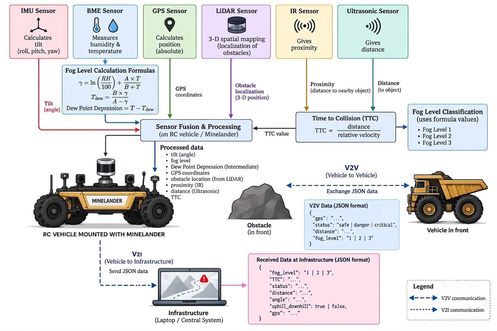

*System architecture diagram. It shows the complete intended design, including blocks that are not yet implemented in code. The table below states exactly what is and is not implemented.*

### Major blocks

**Sensors (inputs)**

| Sensor | Measures | Feeds |
|---|---|---|
| Ultrasonic (HC-SR04-type) | Distance to the object ahead | Median filter, closing speed, TTC, emergency-distance check |
| IR obstacle module | Binary presence of a nearby object | Independent DANGER override |
| MPU6050 IMU | Acceleration, from which pitch is derived | Slope classification and power adjustment |
| Temperature / humidity | Ambient T and RH | Fog formula (currently **hard-coded test values**, see below) |

**Controllers**

| Controller | Role |
|---|---|
| Arduino Nano | Sensor acquisition, filtering, TTC, fog classification, slope classification, safety decision, computing the suggested drive power |
| ESP8266 (NodeMCU-style) | Receives the Nano's decision over UART and drives the actuators |

**Actuators and outputs**

- Two DC gear motors through a motor driver, driven with PWM from the ESP8266 (forward only)
- Status LED
- Active buzzer
- Serial Monitor telemetry over USB on the Nano and the ESP8266

### Data flow

1. The Nano reads the ultrasonic sensor, IR module, and MPU6050 every loop (about 200 ms).
2. Ultrasonic readings go through a 5-sample median filter. The filtered distance and its change over time give the closing speed, and from it the TTC.
3. Fog risk is computed from temperature and humidity, and selects a base drive power.
4. Pitch from the IMU classifies the slope and adds or subtracts a power adjustment.
5. The safety logic (priority order: emergency distance, IR, TTC) selects SAFE, CAUTION, or DANGER.
6. The Nano sends one ASCII line to the ESP8266 over UART at 9600 baud: `SAFE:<power>`, `CAUTION:<power>`, or `DANGER`.
7. The ESP8266 sets motor PWM, LED, and buzzer accordingly.

### Diagram versus current implementation

| Block in the diagram | Status in this repository |
|---|---|
| IMU (roll, pitch, yaw) | **Implemented for pitch only.** The Nano firmware computes pitch from the accelerometer and uses it for slope. Roll and yaw are not computed. |
| BME sensor (humidity & temperature) | **Not read by firmware.** The fog calculation is implemented, but `TEST_TEMPERATURE` / `TEST_HUMIDITY` are hard-coded constants. No BME driver code exists in the repository. |
| Fog level formulas and classification | **Implemented** (Magnus formula, three tiers). The diagram's "Fog Level 1 / 2 / 3" corresponds to LOW / MODERATE / HIGH. |
| Ultrasonic sensor (distance) | **Implemented.** |
| IR sensor (proximity) | **Implemented** as a binary DANGER override. It is not an input to the TTC calculation. |
| Time to Collision | **Implemented**, from ultrasonic distance only. |
| Sensor fusion and processing on the vehicle | **Implemented** on the Arduino Nano. |
| GPS sensor | **Standalone test sketch only** (`gps/gps.ino`, NEO-6M on an ESP8266). Not integrated with the safety firmware. |
| LiDAR (3-D spatial mapping) | **Not part of the microcontroller system.** An RPLIDAR A1M8 (a **2D** scanner) is used with ROS 2 and RViz on a laptop for visualisation. |
| V2V (vehicle-to-vehicle) JSON exchange | **Not implemented.** There is no Wi-Fi, HTTP, MQTT, or JSON code in the repository. |
| V2I (vehicle-to-infrastructure) JSON to a central laptop | **Not implemented.** Same as above. |
| Actuators (not drawn in the diagram) | **Implemented** on the ESP8266: motors, LED, buzzer. |

<details>
<summary>Planned V2V / V2I message formats from the architecture diagram (design intent, not implemented)</summary>

V2V, exchanged with the vehicle in front:

```json
{
  "gps": "...",
  "status": "safe | danger | critical",
  "distance": "...",
  "fog_level": "1 | 2 | 3"
}
```

V2I, sent to the central infrastructure system:

```json
{
  "fog_level": "1 | 2 | 3",
  "TTC": "...",
  "status": "...",
  "distance": "...",
  "angle": "...",
  "uphill_downhill": true,
  "gps": "..."
}
```

Note that the diagram's status vocabulary (`safe | danger | critical`) differs from the firmware's `SAFE | CAUTION | DANGER`. This will need to be reconciled when the messaging layer is built.

</details>

---

## Hardware Components

| Component | Purpose | Interface / pins | Interaction with the system |
|---|---|---|---|
| **Arduino Nano** | Main controller: sensing, filtering, TTC, fog, slope, safety decision | See wiring table below | Sends the decision to the ESP8266 over a `SoftwareSerial` UART |
| **ESP8266 (NodeMCU-style)** | Actuator controller | UART to Nano; PWM to motors; LED; buzzer | Executes the Nano's command. Its Wi-Fi capability is **not used** by the current firmware. |
| **Ultrasonic sensor (HC-SR04-type)** | Distance to the obstacle ahead | Nano D5 (TRIG), D6 (ECHO) | Provides the distance used for TTC and the 10 cm emergency check. No echo returns 400 cm. |
| **IR obstacle module** | Nearby-object detection | Nano D7 (digital, **LOW = obstacle**) | Independent DANGER trigger |
| **MPU6050 IMU** | Tilt measurement | I²C (Wire) on the Nano | Pitch → slope class → power adjustment |
| **Motor driver + 2 DC gear motors** | Vehicle propulsion | ESP8266 D1 (M1, left) and D7 (M2, right), PWM | Drive power scales with fog, slope, and safety state. The other two driver inputs are grounded, so the drive is **forward-only**. |
| **LED** | Visual alert | ESP8266 D4 | Off in SAFE/CAUTION, on in DANGER |
| **Active buzzer** | Audible alert | ESP8266 D2 | Short pulse (SAFE), longer pulse (CAUTION), four rapid pulses (DANGER) |
| **Temperature / humidity sensor** | Fog inputs | Shown in the architecture diagram | **Not read by the current firmware** (hard-coded test values) |
| **NEO-6M GPS** | Position | ESP8266 D4 (RX), D3 (TX) in `gps.ino` | Standalone test sketch only |
| **RPLIDAR A1M8** | 2D LiDAR, 12 m range (per project notes) | USB, used through ROS 2 | Laptop-side visualisation only |
| **Servo + MPU6050 (gimbal)** | Single-axis stabilised platform | Servo on pin 9 in `gimbal.ino` | Standalone test rig |

### Wiring summary (from the firmware)

| Signal | Arduino Nano | ESP8266 |
|---|---|---|
| Ultrasonic TRIG / ECHO | D5 / D6 | |
| IR obstacle output | D7 | |
| UART to ESP8266 (Nano RX / TX) | D4 (RX) / D3 (TX) | |
| UART to Nano (ESP TX / RX) | | D5 (TX) → Nano D4, D6 (RX) ← Nano D3 |
| Motor M1 (left) / M2 (right) | | D1 / D7 |
| LED | | D4 |
| Active buzzer | | D2 |
| MPU6050 | I²C | |

### The controller board

<p align="center">
  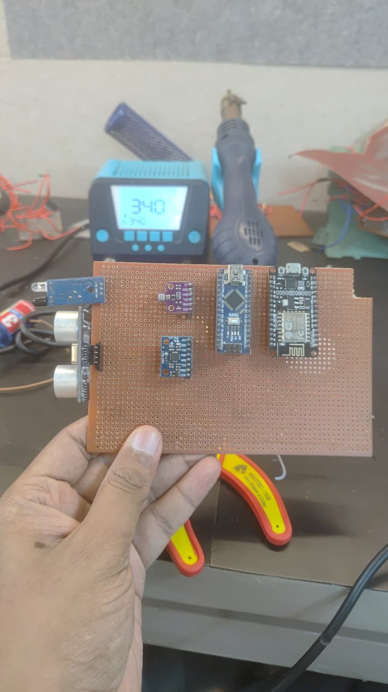
</p>

*The hand-assembled perfboard. Visible: IR obstacle module and ultrasonic sensor (left edge), a small BME board, a blue MPU6050 breakout, the Arduino Nano, and the ESP8266 (NodeMCU-style) board.*

The assembled RC prototype is shown in [Prototype and Results](#prototype-and-results).

### Auxiliary hardware: single-axis gimbal

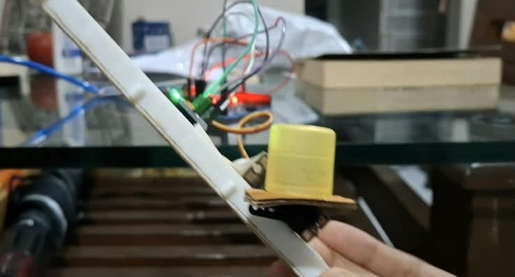

*Frame from a demonstration video of the single-axis gimbal test rig (servo-driven platform).*

`gimbal/gimbal.ino` reads the X-axis angle and gyro rate from an MPU6050 (`MPU6050_tockn` library) and drives a servo on pin 9 with a PD controller (Kp = 1.2, Kd = 0.08, Ki = 0). The servo command is `90 + correction`, constrained to 0–180°, updated every 20 ms. It is a standalone sketch and is not called from the Nano or ESP8266 firmware.

---

## Repository Structure

```text
lander/
├── README.md
├── .gitignore
├── arduino_bot/                    # Physical Minelander firmware
│   ├── minelander-nano.ino         #   CURRENT: Arduino Nano, sensing + safety logic
│   ├── minelander-esp8266.ino      #   CURRENT: ESP8266, PWM motors + LED + buzzer
│   ├── sensor_with_bme.ino         #   earlier Nano revision (4 fog tiers, test values)
│   ├── sensor.ino                  #   earliest Nano revision (manual fogState 1/2/3)
│   └── output.ino                  #   earlier ESP8266 revision (fixed 30 % PWM)
├── gimbal/
│   └── gimbal.ino                  # Single-axis MPU6050 + servo gimbal
├── gps/
│   └── gps.ino                     # NEO-6M GPS reader (ESP8266, TinyGPSPlus)
├── Lidar/                          # ROS 2: RPLIDAR A1M8 + RViz2 viewer (package files stored flat)
│   ├── lidarviewlaunch.py
│   ├── lidar_view.rviz
│   ├── mine_lidar_mapping          # ament resource marker file
│   ├── package.xml
│   ├── setup.py
│   └── setup.cfg
├── src/
│   └── lidar_ttc_bot/              # ROS 2 / Gazebo TTC simulation package
│       ├── lidar_ttc_bot/
│       │   ├── __init__.py
│       │   └── lidar_reader.py     #   TTC node
│       ├── urdf/robot.urdf         #   robot + simulated LiDAR + diff-drive
│       ├── worlds/obstacle_world.world
│       ├── resource/lidar_ttc_bot
│       ├── test/                   #   standard ament lint tests
│       ├── package.xml
│       ├── setup.py
│       └── setup.cfg
└── docs/
    └── images/                     # All README images
```

---

## Software and Code Structure

### Physical Minelander: `arduino_bot/`

| File | Subsystem | What it does | Inputs | Outputs |
|---|---|---|---|---|
| **`minelander-nano.ino`** (current) | Sensing and decision | Reads ultrasonic, IR, and MPU6050; median-filters distance; computes closing speed and TTC; computes fog risk and slope; selects SAFE / CAUTION / DANGER; computes suggested power; prints telemetry | HC-SR04 echo, IR pin, MPU6050 (I²C), test T/RH constants | UART lines to the ESP8266; Serial Monitor text |
| **`minelander-esp8266.ino`** (current) | Actuation | Parses `SAFE:<n>`, `CAUTION:<n>`, `DANGER`; drives motors with PWM (0–100 % mapped to 0–255); LED and buzzer patterns; runs the prototype detour on DANGER | UART from the Nano | Motor PWM (D1, D7), LED (D4), buzzer (D2), Serial Monitor text |
| `sensor_with_bme.ino` | Earlier Nano revision | Same pipeline with four fog tiers (adds VERY HIGH). Despite the filename, **it uses hard-coded test values and no BME driver.** | as above | as above |
| `sensor.ino` | Earliest Nano revision | Same safety logic with a manually set `fogState` (1 = clear, 2 = moderate, 3 = dense); no dew-point calculation | as above | as above |
| `output.ino` | Earlier ESP8266 revision | Same command handling; fixed 30 % PWM (analogWrite 307 on the default 10-bit range); LED and buzzer pins swapped relative to the current file | UART from the Nano | Motors, LED, buzzer |

> **Use `minelander-nano.ino` and `minelander-esp8266.ino`.** The other three files are kept as development history and are superseded.

**Nano → ESP8266 protocol.** One ASCII line per message, terminated by a newline, at 9600 baud:

| Message | Meaning | ESP8266 response |
|---|---|---|
| `SAFE:<0-100>` | Safe, drive at the given percent power | Forward at `<power>` %, short buzzer pulse (150 ms), LED off |
| `CAUTION:<0-100>` | Caution, power already halved by the Nano | Forward at `<power>` %, longer buzzer pulse (250 ms), LED off |
| `DANGER` | Danger | Runs the danger sequence (see [Safety and Decision Logic](#safety-and-decision-logic)) |

### Auxiliary sketches

| File | What it does |
|---|---|
| `gimbal/gimbal.ino` | Single-axis stabilisation: MPU6050 angle + gyro feed a PD controller that drives a servo (pin 9). |
| `gps/gps.ino` | Reads NMEA from a NEO-6M on an ESP8266 (`SoftwareSerial`, D4 RX / D3 TX, 9600 baud) with TinyGPSPlus and prints latitude, longitude, altitude, satellites, HDOP, speed, and UTC date/time once per second at 115200 baud. It warns if no data arrives within 10 s. |

### ROS2 simulation and LiDAR: `src/lidar_ttc_bot/` and `Lidar/`

| File | What it does |
|---|---|
| `src/lidar_ttc_bot/lidar_ttc_bot/lidar_reader.py` | The `lidar_reader` node. Subscribes to the simulated LiDAR and `/cmd_vel`, computes TTC to the closest object in a ±15° forward sector, and prints the result and zone. Publishes nothing. |
| `src/lidar_ttc_bot/urdf/robot.urdf` | Differential-drive robot (0.6 × 0.4 × 0.2 m body, two 0.12 m-radius wheels) with a Gazebo 2D LiDAR sensor and the `diff_drive` plugin. |
| `src/lidar_ttc_bot/worlds/obstacle_world.world` | SDF world: ground plane, sun, and one static 1 × 1 × 1 m box at x = 12 m. |
| `src/lidar_ttc_bot/setup.py` | Registers the console script `lidar_reader`. |
| `Lidar/lidarviewlaunch.py` | Launch file that starts the `rplidar_ros` A1 launch and RViz2 with the saved config. |
| `Lidar/lidar_view.rviz` | RViz2 config: Grid plus a LaserScan display on `/scan`, fixed frame `laser`. |
| `Lidar/package.xml`, `setup.py`, `setup.cfg`, `mine_lidar_mapping` | Package metadata (`mine_lidar_mapping`, data-only ament_python package). See the layout note in [ROS2 Simulation Setup](#ros2-simulation-setup). |

---

## Time to Collision (TTC)

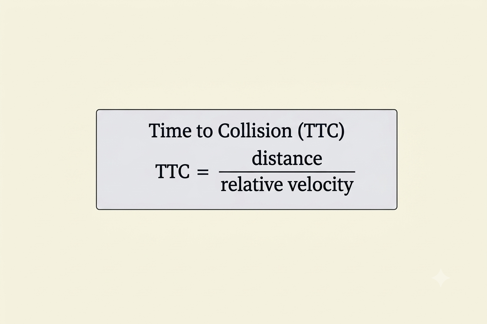

Minelander's TTC is the standard ratio of distance to relative (closing) velocity:

```text
TTC = distance / relative velocity
```

### How it is calculated in the firmware

The Nano has no direct velocity sensor. The relative velocity is derived from how quickly the filtered distance shrinks between two consecutive measurements:

```text
closing_speed = (d_previous - d_now) / Δt          [cm/s]
TTC           = d_now / closing_speed              [s]     (only if closing_speed > 3 cm/s)
```

| Variable | Meaning | Where it comes from |
|---|---|---|
| `d_now` | Current distance to the obstacle, in cm | Median of the last 5 ultrasonic readings. Each reading is `echo_time_µs × 0.0343 / 2`. No echo within 30 ms is treated as 400 cm. |
| `d_previous` | Filtered distance at the previous measurement | Stored from the previous loop iteration |
| `Δt` | Time between the two measurements, in seconds | `millis()` difference (loop delay is 200 ms plus the sensor read time) |
| `closing_speed` | Relative velocity: how fast the gap is shrinking, in cm/s | Computed as above. Positive means approaching; negative means the gap is growing. |
| `TTC` | Estimated seconds until impact if nothing changes | `d_now / closing_speed` |

TTC is only computed when `closing_speed > 3 cm/s` (`MIN_CLOSING_SPEED`). Below that, the firmware reports `TTC: NO MEANINGFUL CLOSING`. TTC measurement starts only after the 5-sample median buffer has filled.

### Thresholds and effect on the safety decision

| TTC | Safety state | Action |
|---|---|---|
| above 8 s (`SAFE_TTC`) | SAFE | Continue |
| above 3 s and up to 8 s | CAUTION | Slow down (suggested power × 0.5) |
| 3 s (`DANGER_TTC`) or less | DANGER | Stop |
| no meaningful closing | SAFE | Continue |

TTC is deliberately **independent of fog**: fog only changes the base drive speed, never the TTC thresholds. TTC is also only one of three DANGER triggers; two hard overrides take priority (see [Safety and Decision Logic](#safety-and-decision-logic)).

Worked examples (computed with the formula above):

| Distance | Closing speed | TTC | State |
|---|---|---|---|
| 100 cm | 10 cm/s | 10.0 s | SAFE |
| 50 cm | 10 cm/s | 5.0 s | CAUTION |
| 30 cm | 12 cm/s | 2.5 s | DANGER |

### Example output from the prototype

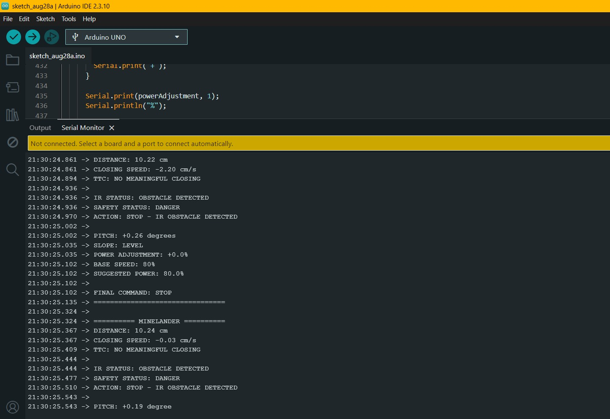

*Serial Monitor capture from a development build of the Nano firmware. Distance is 10.22 cm and the gap is not closing (−2.20 cm/s), so TTC reports "NO MEANINGFUL CLOSING". The IR sensor is triggered, so the state is still DANGER: the IR override outranks TTC. Pitch is +0.26°, so the slope is LEVEL. Some label wording in this capture (for example "SUGGESTED POWER") differs slightly from the current source.*

### TTC in the ROS2 simulation

The simulation computes TTC differently because a Gazebo LiDAR gives range but the node has no separate relative-velocity estimate: it uses `TTC = closest_distance / commanded_speed`, where the speed is the `linear.x` of the latest `/cmd_vel` message. This is valid for a **stationary** obstacle. It uses its own thresholds (SAFE above 6 s, CAUTION above 3 s, DANGER 3 s or less). See [ROS2 Simulation](#ros2-simulation).

---

## Fog and Visibility Calculation

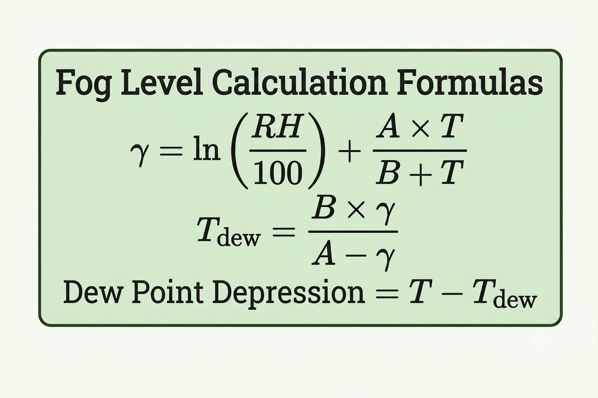

Minelander estimates **fog risk** from how close the air is to saturation. It does not measure visibility or particle density directly. The closer the temperature is to the dew point, the more likely fog is.

### Formulas (Magnus dew-point approximation)

```text
γ      = ln(RH / 100) + (A · T) / (B + T)
T_dew  = (B · γ) / (A − γ)
Dew Point Depression (DPD) = T − T_dew
```

| Variable | Meaning | Value / source |
|---|---|---|
| `T` | Air temperature, °C | `TEST_TEMPERATURE` (default 25.0). **Hard-coded in the current firmware.** |
| `RH` | Relative humidity, % | `TEST_HUMIDITY` (default 90.0). **Hard-coded in the current firmware.** |
| `A` | Magnus constant | 17.62 |
| `B` | Magnus constant, °C | 243.12 |
| `γ` | Intermediate term | Computed |
| `T_dew` | Dew-point temperature, °C | Computed |
| `DPD` | Dew Point Depression, °C | Computed. **Smaller means foggier conditions are more likely.** |

### Thresholds and visibility states

| Dew Point Depression | Fog risk | Diagram label | Base drive power |
|---|---|---|---|
| 2 °C or less | **HIGH** | Fog Level 3 | 40 % |
| above 2 °C and up to 5 °C | **MODERATE** | Fog Level 2 | 60 % |
| above 5 °C | **LOW** | Fog Level 1 | 80 % |

The level numbers follow the earliest firmware revision (`sensor.ino`: 1 = clear, 2 = moderate, 3 = dense). The current firmware uses the text labels LOW / MODERATE / HIGH.

Worked examples (computed from the formulas at 25 °C):

| RH | T_dew | DPD | Fog risk |
|---|---|---|---|
| 90 % (firmware default) | 23.24 °C | 1.76 °C | HIGH |
| 80 % | 21.31 °C | 3.69 °C | MODERATE |
| 70 % | 19.15 °C | 5.85 °C | LOW |

At 25 °C the HIGH/MODERATE boundary falls at about 88.7 % RH and the MODERATE/LOW boundary at about 73.8 % RH.

### Effect on system behaviour

Fog risk sets the **base drive power** used by the Nano (80 / 60 / 40 %). It does **not** change the TTC thresholds or the emergency and IR overrides. Slope adjustment is then added and the result is clamped (see below).

To simulate different weather with the current firmware, edit `TEST_TEMPERATURE` and `TEST_HUMIDITY` at the top of `minelander-nano.ino` and re-flash.

---

## Safety and Decision Logic

### Pipeline

```text
Temperature + Humidity (test values) ──> Dew point depression ──> Fog risk ──> Base power (80/60/40 %)
                                                                                      │
MPU6050 ──> Pitch ──> Slope (LEVEL / UPHILL / DOWNHILL) ──> Power adjustment ─────────┤
                                                                                      ▼
Ultrasonic ──> Median filter ──> Closing speed ──> TTC ──┐                 Suggested power
IR sensor ───────────────────────────────────────────────┼──> Safety state ──> Final power ──> UART ──> ESP8266
Distance <= 10 cm ───────────────────────────────────────┘   (SAFE/CAUTION/DANGER)
```

### Safety state: triggers, in priority order

The Nano evaluates these top to bottom and the first match wins:

| Priority | Condition | State | Action text |
|---|---|---|---|
| 1 | Filtered distance ≤ 10 cm (`EMERGENCY_DISTANCE`) | DANGER | STOP, obstacle too close |
| 2 | IR module output LOW | DANGER | STOP, IR obstacle |
| 3 | Closing speed > 3 cm/s, then TTC > 8 s | SAFE | CONTINUE |
| 3 | Closing speed > 3 cm/s, then 3 s < TTC ≤ 8 s | CAUTION | SLOW DOWN |
| 3 | Closing speed > 3 cm/s, then TTC ≤ 3 s | DANGER | STOP |
| 4 | Otherwise (no meaningful closing) | SAFE | CONTINUE |

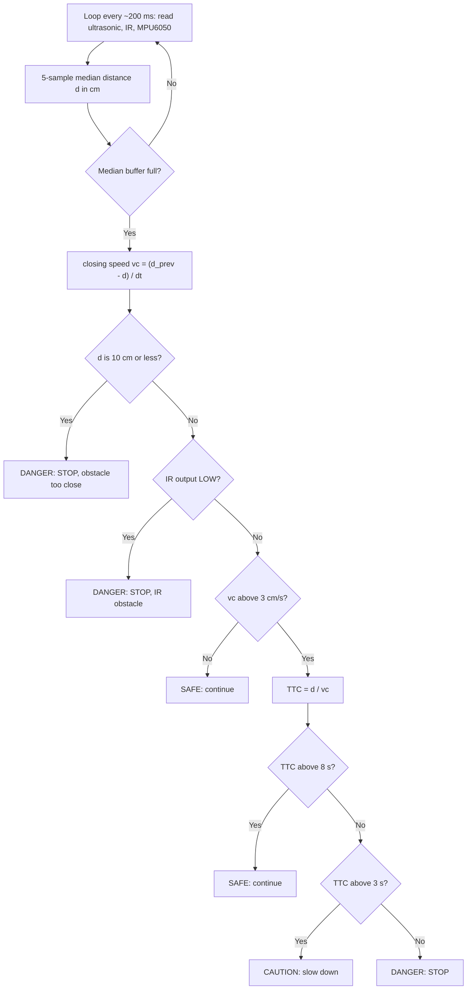

### Slope and power calculation

Pitch is computed from the accelerometer: `pitch = atan2(ax, √(ay² + az²))` in degrees.

| Pitch | Slope | Power adjustment |
|---|---|---|
| above +3° | UPHILL | `+2 × pitch`, capped at +30 % |
| below −3° | DOWNHILL | `2 × pitch` (negative), capped at −30 % |
| within ±3° | LEVEL | 0 |

The sign convention (positive = uphill) depends on how the MPU6050 is mounted on the vehicle.

```text
suggested_power = clamp(base_power + power_adjustment, 0, 100)
SAFE    -> final_power = suggested_power
CAUTION -> final_power = suggested_power × 0.5
DANGER  -> final_power = 0
```

Example: HIGH fog (base 40 %) on a +5° uphill gives 40 + 10 = 50 % in SAFE, 25 % in CAUTION, and 0 % in DANGER.

### Responses by state

| State | Nano | ESP8266 |
|---|---|---|
| **SAFE** | Sends `SAFE:<power>` | Drives forward at that power, short buzzer pulse, LED off |
| **CAUTION** | Sends `CAUTION:<power>` (already halved) | Drives forward at that power, longer buzzer pulse, LED off |
| **DANGER** | Sends `DANGER` once, then **latches** | Stops, LED on, four rapid buzzer pulses, then runs the detour sequence below, then remains stopped |

### The DANGER response (prototype behaviour)

> Reminder: Minelander is a monitoring and alerting system. In the intended use the driver decides how to respond. The sequence below exists so the prototype can *demonstrate* a full response on a bench-scale RC vehicle.

On `DANGER` the ESP8266 (`executeDangerSequence()`): stops the motors, turns the LED on, sounds the aggressive buzzer pattern, then performs a fixed, timed detour (right turn, short forward segment, left, forward, left, forward, right, forward), stops, prints `DETOUR COMPLETE`, and then loops forever holding the motors off with the LED on and the buzzer sounding every second. Turns are timed (700 ms) and forward segments are timed (800 ms), not sensor-guided.

**Latching.** On the Nano, `dangerTriggered` is never cleared, so after the first DANGER no further `SAFE`/`CAUTION` commands are sent. On the ESP8266 the danger sequence never returns. **A reset or power cycle of both boards is required to resume normal operation.**

Motor drive on the ESP8266: speed 0–100 % is mapped to PWM 0–255; the right motor gets a +2 % trim relative to the left. Because the other two motor-driver inputs are grounded, the vehicle can only drive forward.

---

## System Workflow

### Physical Minelander (no ROS 2 involved)

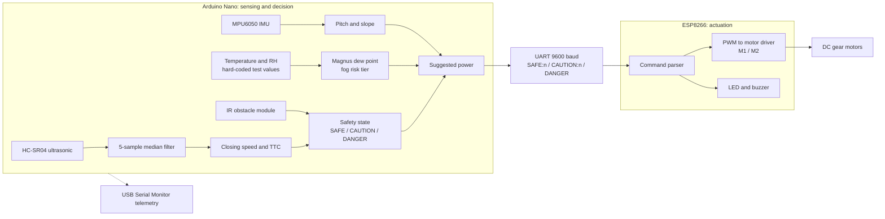

### ROS2 Simulation (laptop only, separate from the hardware)

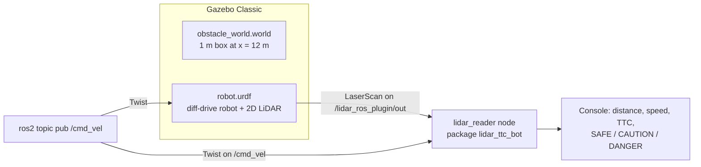

### LiDAR bench visualisation (real sensor, laptop only)

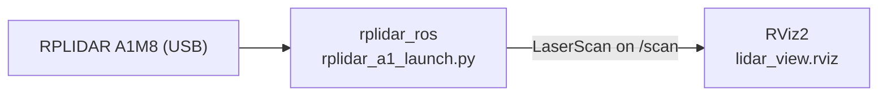

---

## ROS2 Simulation

> **ROS 2 is used as a simulation/testing environment. It is NOT the underlying software platform of the physical Minelander hardware system.** Nothing in `arduino_bot/`, `gimbal/`, or `gps/` uses ROS 2, and the ROS 2 code does not communicate with the microcontrollers.

### What is simulated, and why ROS 2

The microcontroller prototype uses an ultrasonic sensor at bench scale. To explore TTC with a LiDAR over longer ranges (which the hardware prototype does not do), the project uses ROS 2 with Gazebo (virtual robot, virtual obstacle, virtual LiDAR) and RViz (live LiDAR display). ROS 2 provides the ready-made LiDAR message types, Gazebo plugins, and visualisation tools for this. **Everything in the Gazebo part is virtual**, so it cannot be used to judge real-world values.

### Packages

| Package | Location | Type | Purpose |
|---|---|---|---|
| `lidar_ttc_bot` | `src/lidar_ttc_bot/` | ament_python | Gazebo robot + world and the `lidar_reader` TTC node |
| `mine_lidar_mapping` | `Lidar/` | ament_python (data-only) | Launch file and RViz config for a real RPLIDAR A1M8. Depends on `rplidar_ros`, `rviz2`, `launch`, `launch_ros`. |

### Nodes

| Node / plugin | Source | Role |
|---|---|---|
| `lidar_reader` | `lidar_reader.py` | Custom TTC node (subscribes, prints; publishes nothing) |
| `diff_drive` (`libgazebo_ros_diff_drive.so`) | `robot.urdf` | Turns `/cmd_vel` into wheel motion; configured to publish `odom` |
| `lidar_ros_plugin` (`libgazebo_ros_ray_sensor.so`) | `robot.urdf` | Publishes the simulated LiDAR as `sensor_msgs/LaserScan` |
| `rplidar_ros` node, `rviz2` | External packages, started by `lidarviewlaunch.py` | Real LiDAR driver and viewer |

### Topics

| Topic | Type | Producer → Consumer |
|---|---|---|
| `/lidar_ros_plugin/out` | `sensor_msgs/LaserScan` | Gazebo LiDAR → `lidar_reader` |
| `/cmd_vel` | `geometry_msgs/Twist` | You (`ros2 topic pub`) → Gazebo diff-drive **and** `lidar_reader` |
| `/odom` | odometry | Gazebo diff-drive (configured in the URDF; not used by the repo's node) |
| `/scan` | `sensor_msgs/LaserScan` | `rplidar_ros` → RViz2 (real-LiDAR viewer only) |

### Sensor simulation

The URDF mounts a `ray` sensor on `lidar_link` (0.3 m above the base): 360 samples over −π to +π, 10 Hz, range 0.12 m to 10 m. The robot is a differential-drive base (wheel separation 0.5 m, wheel diameter 0.24 m).

### Obstacle scenario

`obstacle_world.world` contains a single static 1 × 1 × 1 m box named `box1` at x = 12 m, y = 0. Because the LiDAR range is 10 m, the box is not visible until the robot is within 10 m of it, and the node prints `No obstacle detected in front` until then.

### TTC and safety-logic testing

`lidar_reader` keeps the ranges within ±0.26 rad (about ±15°) of straight ahead, ignores non-finite values, takes the closest, and computes:

```text
TTC = closest_distance / robot_speed        (robot_speed = linear.x of the latest /cmd_vel)
```

| Condition | Printed zone |
|---|---|
| `robot_speed ≤ 0` | "Vehicle stopped" (no TTC) |
| TTC above 6 s | SAFE |
| TTC above 3 s and up to 6 s | CAUTION |
| TTC 3 s or less | DANGER |

The node only **prints**. It does not publish commands back, so the simulated robot does not brake by itself. The speed is the *commanded* speed, not a measured one, and the method is only valid for a static obstacle. The 6 s / 3 s thresholds are the simulation's own and differ from the Arduino firmware's 8 s / 3 s.

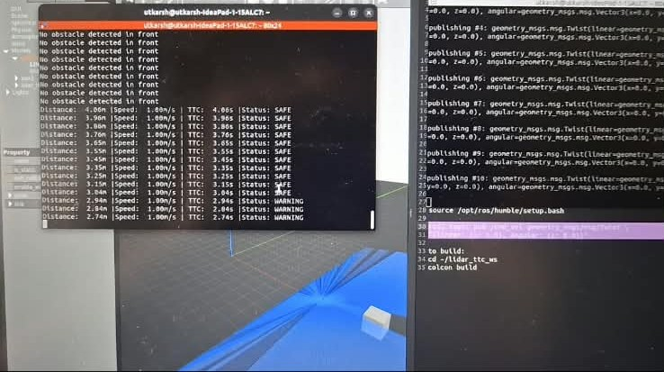

*Gazebo scene (left), `lidar_reader` output (centre), and build and publish notes (right). The distance falls in 0.1 m steps at 1.00 m/s and TTC falls with it. This capture is from an earlier iteration: it labels the second state "WARNING" and changes state at 3 s, whereas the current source uses "CAUTION" with SAFE above 6 s.*

### LiDAR visualisation (real RPLIDAR A1M8)

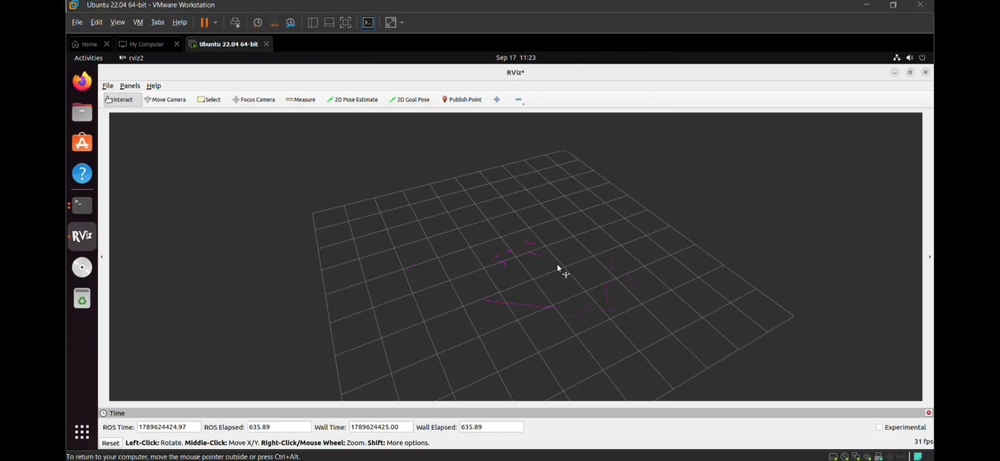

*Live RPLIDAR scan points in RViz2 (Ubuntu 22.04 VM). Each scan arrives on `/scan`; RViz draws the points, which together outline the shape of the room.*

`lidarviewlaunch.py` starts the stock `rplidar_a1_launch.py` from `rplidar_ros` and RViz2 with `lidar_view.rviz`, so the LiDAR and viewer come up with a single command.

### How to run it

See [ROS2 Simulation Setup](#ros2-simulation-setup).

---

## Prototype and Results

### What has been built

- **Physical Minelander prototype**: a hand-assembled perfboard (Arduino Nano, ESP8266, ultrasonic sensor, IR module, MPU6050) mounted on an RC-scale chassis with two DC gear motors.
- **Single-axis gimbal test rig** (servo + MPU6050).
- **NEO-6M GPS reader** sketch.
- **ROS 2 / Gazebo TTC simulation** and a **real-LiDAR RViz viewer**.

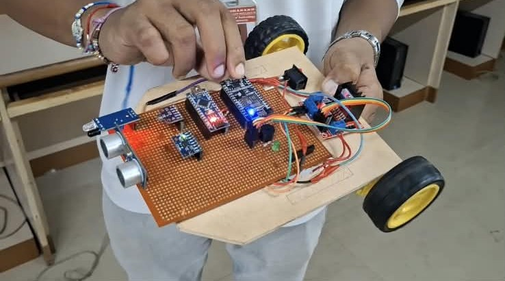

*The Minelander perfboard mounted on the RC chassis with yellow-wheeled DC gear motors.*

### What has been demonstrated

- The prototype produces live Serial Monitor telemetry for distance, closing speed, TTC, IR status, safety status, action, pitch, slope, and power (see the capture in [Time to Collision (TTC)](#time-to-collision-ttc)).
- The IR override and DANGER state trigger correctly in the captured run.
- The Gazebo simulation prints distance, speed, TTC and a zone as a simulated robot approaches the box (capture in [ROS2 Simulation](#ros2-simulation)).
- The RPLIDAR A1M8 scans display in RViz2 (indoor, static test).

### What is *not* reported here

No quantitative results (accuracy, latency, detection range, TTC error, fog-classification accuracy) are recorded in this repository, so none are claimed. No field or mine-environment testing is documented. See [Limitations](#limitations).

---

## Installation and Setup

### Physical Hardware Setup

*No ROS 2 is needed for this part.*

**1. Get the tools**

- Arduino IDE (the project's screenshots use IDE 2.3.x).
- For the ESP8266: add the ESP8266 board package via *File → Preferences → Additional Boards Manager URLs* with `http://arduino.esp8266.com/stable/package_esp8266com_index.json`, then install **esp8266** in the Boards Manager.

**2. Install libraries** (Library Manager)

| Sketch | Libraries |
|---|---|
| `minelander-nano.ino` | **Adafruit MPU6050**, **Adafruit Unified Sensor** (accept the dependency prompt); `SoftwareSerial` and `Wire` are built in |
| `minelander-esp8266.ino` | None beyond the ESP8266 core (`SoftwareSerial` is provided by the core) |
| `gimbal/gimbal.ino` | **MPU6050_tockn**; `Servo` and `Wire` are built in |
| `gps/gps.ino` | **TinyGPSPlus** |

**3. Wire the hardware** using the [wiring summary](#wiring-summary-from-the-firmware). Common ground between the Nano and the ESP8266 is required for the UART link. The power arrangement is not documented in this repository.

**4. Put each sketch in its own folder.** The Arduino IDE expects a sketch to live in a folder with the same name. `arduino_bot/` holds several sketches, so copy the two you need into their own folders, for example `minelander-nano/minelander-nano.ino` and `minelander-esp8266/minelander-esp8266.ino` (or accept the IDE's offer to create the folder when you open the file). Do not compile the whole `arduino_bot/` folder as one sketch: the files define `setup()` and `loop()` more than once.

**5. Flash**

- `minelander-nano.ino` → **Arduino Nano** (select the matching processor/bootloader for your board).
- `minelander-esp8266.ino` → your **ESP8266 (NodeMCU-style)** board.

**6. Watch the telemetry.** Open the Serial Monitor at **9600 baud** on each board. The Nano prints a `MINELANDER` status block roughly every 200 ms once its median buffer is full; the ESP8266 prints `NANO -> ESP: <command>` lines.

**7. Try different fog conditions.** Edit `TEST_TEMPERATURE` and `TEST_HUMIDITY` in `minelander-nano.ino` and re-flash. Remember that the DANGER state latches until both boards are reset.

### ROS2 Simulation Setup

*This is a separate, laptop-only environment.*

**Prerequisites.** The project was developed on Ubuntu 22.04 with ROS 2 Humble (its captures show `source /opt/ros/humble/setup.bash`). The URDF uses the Gazebo **Classic** ROS plugins.

```bash
sudo apt install ros-humble-gazebo-ros-pkgs ros-humble-rviz2 python3-colcon-common-extensions
sudo apt install ros-humble-rplidar-ros     # only for the real-LiDAR viewer
```

#### A. Gazebo TTC simulation (`lidar_ttc_bot`)

The repository root can be used directly as the colcon workspace (its `.gitignore` already excludes `build/`, `install/`, `log/`).

```bash
git clone https://github.com/poojariutkarsh1/lander.git
cd lander
source /opt/ros/humble/setup.bash
colcon build --packages-select lidar_ttc_bot
source install/setup.bash
```

`--packages-select` is important: it skips `Lidar/`, which needs the re-arrangement described in section B before it can build.

The repository has no Gazebo launch file, so start the pieces manually (each in its own terminal, with `source /opt/ros/humble/setup.bash` run first; also `source install/setup.bash` in the terminal that runs the node):

```bash
# Terminal 1: Gazebo with the obstacle world and ROS integration
gazebo --verbose src/lidar_ttc_bot/worlds/obstacle_world.world -s libgazebo_ros_init.so -s libgazebo_ros_factory.so

# Terminal 2: spawn the robot
ros2 run gazebo_ros spawn_entity.py -entity lidar_ttc_bot -file src/lidar_ttc_bot/urdf/robot.urdf

# Terminal 3: start the TTC node
ros2 run lidar_ttc_bot lidar_reader

# Terminal 4: drive forward at 1 m/s toward the box
ros2 topic pub -r 10 /cmd_vel geometry_msgs/msg/Twist "{linear: {x: 1.0, y: 0.0, z: 0.0}, angular: {x: 0.0, y: 0.0, z: 0.0}}"
```

You should see `No obstacle detected in front` until the robot is within 10 m of the box, then distance, speed, TTC and zone lines. Stop the publisher (Ctrl+C) and send `x: 0.0` to halt the robot.

> The Gazebo, spawn, and `ros2 topic pub` commands above are the standard Gazebo Classic / ROS 2 Humble forms; they are not scripted anywhere in the repository.

#### B. Real-LiDAR viewer (`mine_lidar_mapping`)

**Layout note.** The files in `Lidar/` are stored flat, but `Lidar/setup.py` expects the standard ament_python layout: a `resource/` marker file, a `launch/` folder containing files named `*_launch.py`, and an `rviz/` folder. Built as committed, the package fails with `can't copy 'resource/mine_lidar_mapping'`, and a launch file not ending in `_launch.py` would not be installed. Build it in a workspace arranged like this:

```bash
mkdir -p ~/lidar_ws/src/mine_lidar_mapping/{launch,rviz,resource}
cd lander/Lidar
cp package.xml setup.py setup.cfg ~/lidar_ws/src/mine_lidar_mapping/
cp lidarviewlaunch.py ~/lidar_ws/src/mine_lidar_mapping/launch/lidar_view_launch.py
cp lidar_view.rviz ~/lidar_ws/src/mine_lidar_mapping/rviz/
cp mine_lidar_mapping ~/lidar_ws/src/mine_lidar_mapping/resource/

cd ~/lidar_ws
source /opt/ros/humble/setup.bash
colcon build --packages-select mine_lidar_mapping
source install/setup.bash
```

Connect the RPLIDAR A1M8 over USB (see the `rplidar_ros` documentation for serial-port settings and permissions), then:

```bash
ros2 launch mine_lidar_mapping lidar_view_launch.py
```

---

## Limitations

**Physical Minelander prototype (`arduino_bot`)** (from the project notes)

- The motors do not work properly.
- The IR sensor picked up sunlight and produced false readings.
- At higher vehicle speeds, TTC worked poorly.

**Additional limitations evident from the code**

- **Fog inputs are hard-coded.** The current firmware does not read a temperature/humidity sensor; fog risk reflects the constants in the source, not real conditions.
- **TTC relies on a single forward-facing ultrasonic sensor** with a 5-sample median filter and a ~200 ms loop. Closing speeds of 3 cm/s or less are treated as "no meaningful closing", so a very slow approach is caught only by the 10 cm and IR overrides.
- **DANGER is latched** until both boards are reset, and the detour is a fixed, timed, open-loop sequence (not sensor-guided).
- **Forward-only drive**: the motor driver's other inputs are grounded, so the vehicle cannot reverse.
- **Subsystems are not integrated:** the gimbal, the GPS reader, and the LiDAR are separate from the Nano/ESP8266 safety pipeline.
- **No V2V / V2I communication** exists in the code, although it appears in the architecture diagram.
- **No quantitative validation** or field testing is recorded.

**ROS2 TTC simulation (`lidar_ttc_bot`)**

- It is a simulation; the values cannot be used to judge real-world performance.
- TTC uses the commanded `/cmd_vel` speed, not measured relative velocity, so it is only meaningful for a static obstacle.
- The node prints only; it does not feed back into the simulated robot.
- Thresholds (6 s / 3 s) are not calibrated against the hardware firmware (8 s / 3 s).

**LiDAR (`Lidar`)** (from the project notes)

- **No map is saved.** Only the live scan is displayed; previous data disappears with each new scan. A real map would need `slam_toolbox`.
- **The LiDAR's own position is not tracked.** If it moves, the system does not know where it moved from or to. `rf2o_laser_odometry` (consecutive-scan matching) is the planned fix.
- **2D scan, up to 12 m range only.** It will not detect potholes or objects above the scanning plane, and its range may decrease in dense fog.
- **Only indoor, static testing has been done.** It has not been tested on a moving vehicle or in dust or fog.
- The package files are stored flat and do not build as committed (see [ROS2 Simulation Setup](#ros2-simulation-setup)).

---

## Future Work

> Everything in this section is **planned or proposed and is not implemented** in the repository.

**From the documented limitations**

- Add `slam_toolbox` so the LiDAR data produces a persistent map.
- Add `rf2o_laser_odometry` so the LiDAR's movement is estimated from consecutive scans.
- Combine LiDAR with radar and a camera with YOLO through sensor fusion, rather than relying on LiDAR alone.
- Mount the LiDAR on a moving rig and test in dust and fog.
- Fix the prototype's motor problems, the IR sensor's sunlight sensitivity, and TTC performance at higher speeds.
- Validate the simulation's behaviour against real measurements.

**To close the gap with the architecture diagram**

- Read a real temperature/humidity sensor and feed it into the existing fog calculation.
- Integrate GPS position into the main pipeline.
- Implement V2V and V2I messaging (JSON) between vehicles and a central system, including reconciling the status vocabulary.
- Bring LiDAR-based obstacle localisation into the on-vehicle system.
- Fix the `Lidar/` package layout so it builds directly from the repository.

---

## Credits

Contributors, from the repository's Git history:

- **Utkarsh Uday Poojari** ([@poojariutkarsh1](https://github.com/poojariutkarsh1)): Arduino Nano and ESP8266 firmware, gimbal, ROS 2 / Gazebo TTC simulation, repository owner.
- **Arnav Nair** ([@arnavnair](https://github.com/arnavnair)): LiDAR / RViz package (`Lidar/`), NEO-6M GPS reader.
- **Raj Narayan**: contribution to `output.ino`.

<!-- Add team name, institution, mentors and hackathon details here. -->

## License

No `LICENSE` file is present in this repository. `Lidar/package.xml` declares MIT, while `src/lidar_ttc_bot/package.xml` still contains a `TODO` license placeholder. Add a `LICENSE` file to make the terms explicit.
